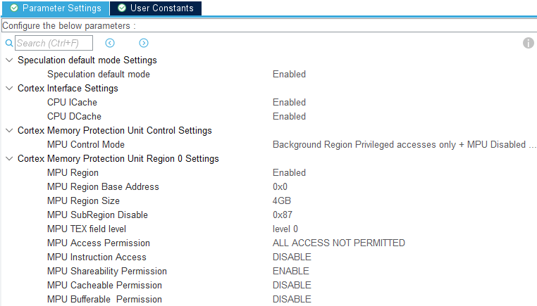
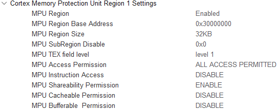
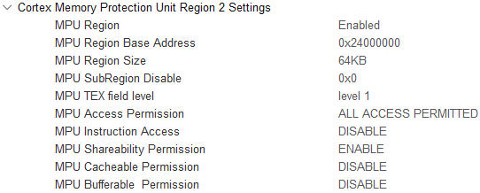

# OpenTubeLight - Code Documentation

## Ethernet and LwIP Setup

### Memory structure

Here is how I structured the memory for the Ethernet and LwIP components. All are 32-byte aligned.

| Item           | Name                     | File         | Memory Location | Size [B]             |
|----------------|--------------------------|--------------|-----------------|----------------------|
| TX descriptors | DMATxDscrTab             | ethernetif.c | 0x300001e0      | 96                   |
| RX descriptors | DMARxDscrTab             | ethernetif.c | 0x30000000      | 480                  |
| RX buffers     | memp_memory_RX_POOL_base | ethernetif.c | 0x24008000      | 20*(1536+32) = 31360 |
| LwIP heap      | LWIP_RAM_HEAP_POINTER    | lwipopts.h   | 0x24000000      | 32*1024              |

### Ethernet MX settings

Mode: RMII

#### Parameter settings
Tx Descriptor Length: 4

First Tx Descriptor Address: 0x300001e0

Rx Descriptor Length: 20

First Rx Descriptor Address: 0x30000000

Rx Buffers Address: 0x24008000

Rx Buffers Length: 1536

#### NVIC settings
Ethernet global interrupt: Enabled

#### GPIO settings
All set to "Very High" Maximum output speed.

### LwIP MX settings

#### General settings
MEMP_NUM_UDP_PCB: 10

#### Key Options
MEM_SIZE (Heap Memory Size): 32*1024

LWIP_RAM_HEAP_POINTER: 0x24000000

ETH_RX_BUFFER_CNT: 20

MEMP_NUM_PBUF: 16

PBUF_POOL_SIZE: 24

PBUF_POOL_BUFSIZE: 1536

Advanced:
IP_REASSEMBLY: Disabled (caused issues with ICMP packets of large size such as ping with 1500 bytes)

#### Platform settings
Selected LAN8742A driver.

#### Checksum
CHECKSUM_BY_HARDWARE: Enabled 


### MPU MX settings
#### Base - Region 0
This disables speculative access for unused memory regions.



#### D2 - Region 1
This disables cache for the D2 ram in which DMA descriptors are placed.




#### D1 - Region 2
This disables cache for the beginning of D1 ram in which the LwIP heap and RX pools are placed.



### Linker script
The modifications of STM32H723VETX_FLASH.ld are as follows:

The definition of the memory areas is modified. The first 64K of D1 RAM are reserved for LwIP Heap and RX pools. The original RAM_D1 area begins at 0x24010000 instead of 0x24000000 and is shortened by 64K. 
```ld
/* Specify the memory areas */
MEMORY
{
  ITCMRAM (xrw)    : ORIGIN = 0x00000000,   LENGTH = 64K
  DTCMRAM (xrw)    : ORIGIN = 0x20000000,   LENGTH = 128K
  FLASH    (rx)    : ORIGIN = 0x08000000,   LENGTH = 512K 
  RAM_D1_LWIP  (xrw)    : ORIGIN = 0x24000000,   LENGTH = 64K /* USER ADDED FOR A NICE MPU ALIGNMENT */
  RAM_D1  (xrw)    : ORIGIN = 0x24010000,   LENGTH = 256K /* ORIGINAL ADDRESS WAS 0x24000000 */
  RAM_D2  (xrw)    : ORIGIN = 0x30000000,   LENGTH = 32K
  RAM_D3  (xrw)    : ORIGIN = 0x38000000,   LENGTH = 16K
}
```


Added a section for the RX pools, which are placed in the second half of the 64KB RAM_D1_LWIP area. ".Rx_PoolSection" attribute is defined in ethernetif.c.
```ld
  .rxpool_sec 0x24008000 (NOLOAD) : {
      . = ALIGN(32);
      *(.Rx_PoolSection) 
      . = ALIGN(32);
  } >RAM_D1_LWIP
```


Added a section for D2 DMA stuff.
```ld
  .d2_dma_nocache_sec (NOLOAD) : {
        . = ABSOLUTE(0x30000000);
        . = ALIGN(32);
        *(.RxDecripSection)   /* Eth Rx Descriptors */
        *(.TxDecripSection)   /* Eth Tx Descriptors */
        
        . = ALIGN(32);
        *(.spi_buffers)       /* LED Strip SPI buffers*/
        *(.uart_buffers)      /* DMX UART buffers*/
    } >RAM_D2
```