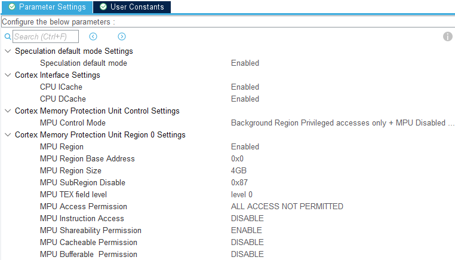
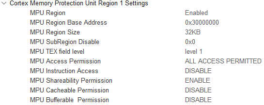
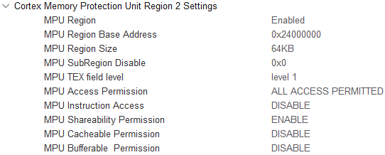

# OpenTubeLight - Code Documentation

## BUGS:

### The device is not discoverable, or broadcastable with a direct ethernet connection to a laptop
- this may be an issue with the networking settings on the laptop, or with the networking settings of the device, or both.

#### When the direct connection doesn't work:
- connecting straight to the laptop, after reset, or before reset

Laptop's network settings:
- Manual IP address: 192.168.1.2
- Manual subnet mask: 255.255.255.0
- Manual router: 192.168.1.3

Device's network settings:
- idk, dhcp enabled

#### When the direct connection works:
- When we start the device and connect it to my larger home network, it works as it should - responds to data on the network. If I then unplug the device's ethernet from my home network and connect it directly to the laptop, it is discoverable and works great with the direct connection. However, if I restart the device, it stops working on the direct connection.

- The laptop's network settings are the same as above


### DMX input periodic glitches
- need to text more

### Random light glitches, when connected to home network
- artnet input. 
- doesnt happen when connecting directly with a laptop, only on the home network

this shit seems to happen with a firmware version before DMX512 was even implemented, so the issue is long. However, double check this, I am not sure if I remember correctly.

UPDATE: THIS HAPPENS ON A DIRECT CONNECTION TOO. (connecting directly after being connected to the home network), i have to test if it happens after a power cycle without ever connecting to the home network.

Findings:
1. High dimmer input, 8 segments: Flashes appear across the whole length of the strip
2. High dimmer input, 144 segments: Flashes seem to be more concentrated at the beginning of the strip, suggesting a DMX problem in the first few adresses, but sometiimes it flashes more towards the middle of the strip
3. Low dimmer input, changes with color, 8 segments: when sending a dark blue sine wave from light key at around 1 percent master dimmer, there are some dim green flashes in the first few LEDs of the strip. They don't span across one whole segment, which is weird as it indicates a problem with how the LED strip is driven?
 - actually, this happens with high dimmer also.

All of this seems to be color dependent for some reason. 

8seg: When sending from qlc and freezing the universe output at a blueish colors, the flashes happen frequently. With red, green only, no problems. When sending zeroes, no problems. 

8seg: When controlling from simple desk in qlc: when setting all 8 blues to full and dimming the red or green colors, the flashes begin to happen. Not with blue only, not with red or green only. Also, some are full segment, some are just an led at the beginning. Also, in simple desk, it seems like only the few segment affects things, not all.

144seg: Actually, it seems that it is not color dependent. Simple desk changing first red, green, blue gives flashes.

I didn't see the flashes in wireshark dmx data.


## Very unorganized TODO LIST:
- spi led strips should be continuously updated, even if no new data is received. this is because interference can cause artifacts in the led strip over time. (maybe every 300 ms or so)
- Class A ip addressing after conneciton per artnet spec
- Implement ArtPollReply node status reporting
- For modes that require more than 4 universes, implement bindindex

Configuration via the display and buttons will be added to this device for changing the settings. These settings must update the functionality of the device while it is running, so the code must be structured in a way that allows for this. 
The settings must saved to flash so that they are kept if the device loses power. There needs to be a factory default device configuration that the device will start with after uploading the firmware. Also, the user will have the ability to reset the device to factory defaults. 
These are some of the settings that should be configurable:

Device name
- long name (must be compatible with Art-Net long name)
- short name (must be compatible with Art-Net short name)

IP configuration
- DHCP/static
- if static: IP address, mask

Strip layout configuration
- number of physical pixels
- segment count
- segment format (so far we only have RGB, but later there will be options for RGBD, or 16-bit RGB, etc.)

DMX protocol
- input via either DMX or Art-Net
- start address (and also start universe for Art-Net)
- note: the channel count of the device is calculated by the strip layout configuration 
- note: the number of universes that Art-Net must recieve is determined by the channel count and the start address

Failsafe behavior
- hold last state/full/zero


Other settings may appear as development continues.


## Ethernet and LwIP Setup

### Memory structure

Here is how I structured the memory for the Ethernet and LwIP components. All are 32-byte aligned.

| Item           | Name                     | File         | Memory Location | Size [B]             |
|----------------|--------------------------|--------------|-----------------|----------------------|
| TX descriptors | DMATxDscrTab             | ethernetif.c | 0x300001e0      | 96                   |
| RX descriptors | DMARxDscrTab             | ethernetif.c | 0x30000000      | 480                  |
| RX buffers     | memp_memory_RX_POOL_base | ethernetif.c | 0x24008000      | 20*(1536+32) = 31360 |
| LwIP heap      | LWIP_RAM_HEAP_POINTER    | lwipopts.h   | 0x24000000      | 32*1024              |

### Ethernet MX settings

Mode: RMII

#### Parameter settings
Tx Descriptor Length: 4

First Tx Descriptor Address: 0x300001e0

Rx Descriptor Length: 20

First Rx Descriptor Address: 0x30000000

Rx Buffers Address: 0x24008000

Rx Buffers Length: 1536

#### NVIC settings
Ethernet global interrupt: Enabled

#### GPIO settings
All set to "Very High" Maximum output speed.

### LwIP MX settings

#### General settings
MEMP_NUM_UDP_PCB: 10

#### Key Options
MEM_SIZE (Heap Memory Size): 32*1024

LWIP_RAM_HEAP_POINTER: 0x24000000

ETH_RX_BUFFER_CNT: 20

MEMP_NUM_PBUF: 16

PBUF_POOL_SIZE: 24

PBUF_POOL_BUFSIZE: 1536

Advanced:
IP_REASSEMBLY: Disabled (caused issues with ICMP packets of large size such as ping with 1500 bytes)

#### Platform settings
Selected LAN8742A driver.

#### Checksum
CHECKSUM_BY_HARDWARE: Enabled 


### MPU MX settings
#### Base - Region 0
This disables speculative access for unused memory regions.



#### D2 - Region 1
This disables cache for the D2 ram in which DMA descriptors are placed.




#### D1 - Region 2
This disables cache for the beginning of D1 ram in which the LwIP heap and RX pools are placed.



### Linker script
The modifications of STM32H723VETX_FLASH.ld are as follows:

The definition of the memory areas is modified. The first 64K of D1 RAM are reserved for LwIP Heap and RX pools. The original RAM_D1 area begins at 0x24010000 instead of 0x24000000 and is shortened by 64K. 
```ld
/* Specify the memory areas */
MEMORY
{
  ITCMRAM (xrw)    : ORIGIN = 0x00000000,   LENGTH = 64K
  DTCMRAM (xrw)    : ORIGIN = 0x20000000,   LENGTH = 128K
  FLASH    (rx)    : ORIGIN = 0x08000000,   LENGTH = 512K 
  RAM_D1_LWIP  (xrw)    : ORIGIN = 0x24000000,   LENGTH = 64K /* USER ADDED FOR A NICE MPU ALIGNMENT */
  RAM_D1  (xrw)    : ORIGIN = 0x24010000,   LENGTH = 256K /* ORIGINAL ADDRESS WAS 0x24000000 */
  RAM_D2  (xrw)    : ORIGIN = 0x30000000,   LENGTH = 32K
  RAM_D3  (xrw)    : ORIGIN = 0x38000000,   LENGTH = 16K
}
```


Added a section for the RX pools, which are placed in the second half of the 64KB RAM_D1_LWIP area. ".Rx_PoolSection" attribute is defined in ethernetif.c.
```ld
  .rxpool_sec 0x24008000 (NOLOAD) : {
      . = ALIGN(32);
      *(.Rx_PoolSection) 
      . = ALIGN(32);
  } >RAM_D1_LWIP
```


Added a section for D2 DMA stuff.
```ld
  .d2_dma_nocache_sec (NOLOAD) : {
        . = ABSOLUTE(0x30000000);
        . = ALIGN(32);
        *(.RxDecripSection)   /* Eth Rx Descriptors */
        *(.TxDecripSection)   /* Eth Tx Descriptors */
        
        . = ALIGN(32);
        *(.spi_buffers)       /* LED Strip SPI buffers*/
        *(.uart_buffers)      /* DMX UART buffers*/
    } >RAM_D2
```